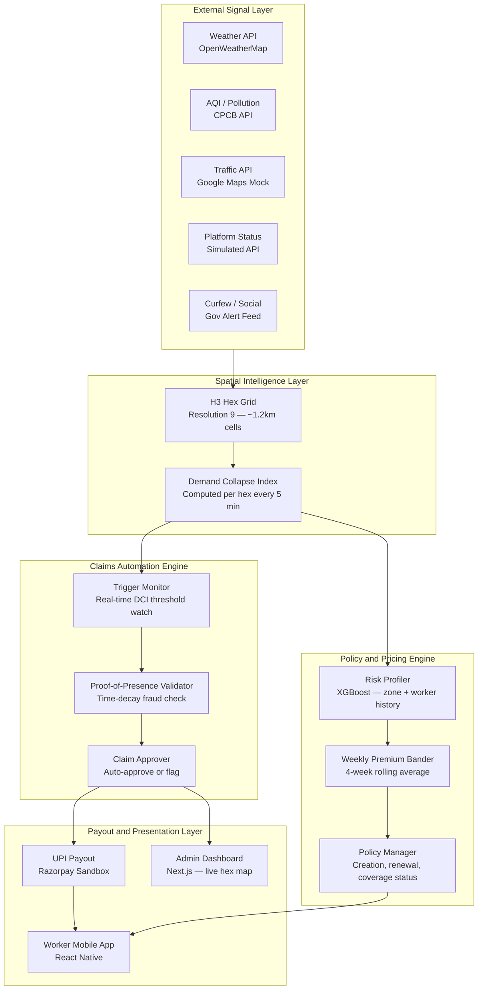
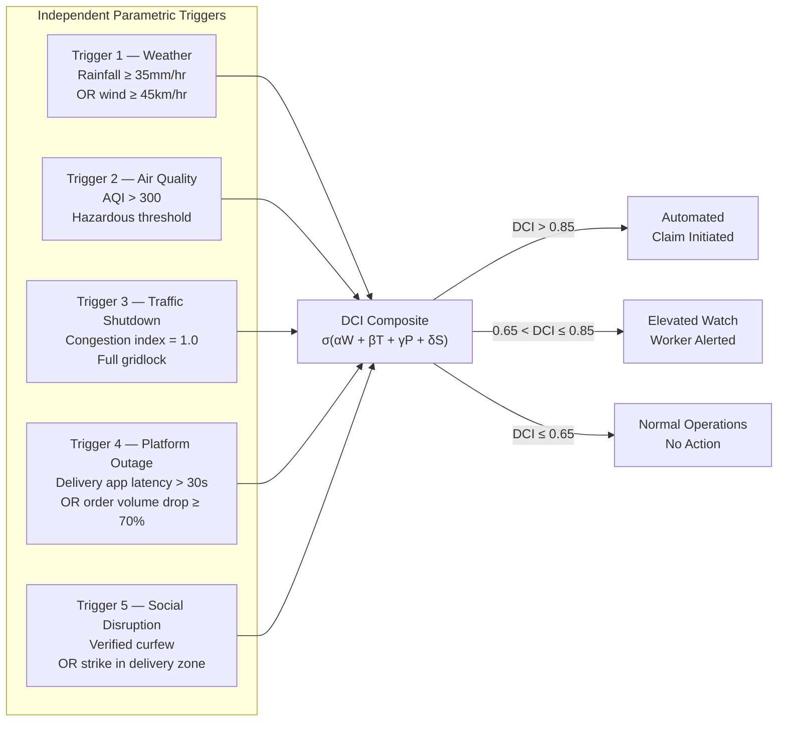
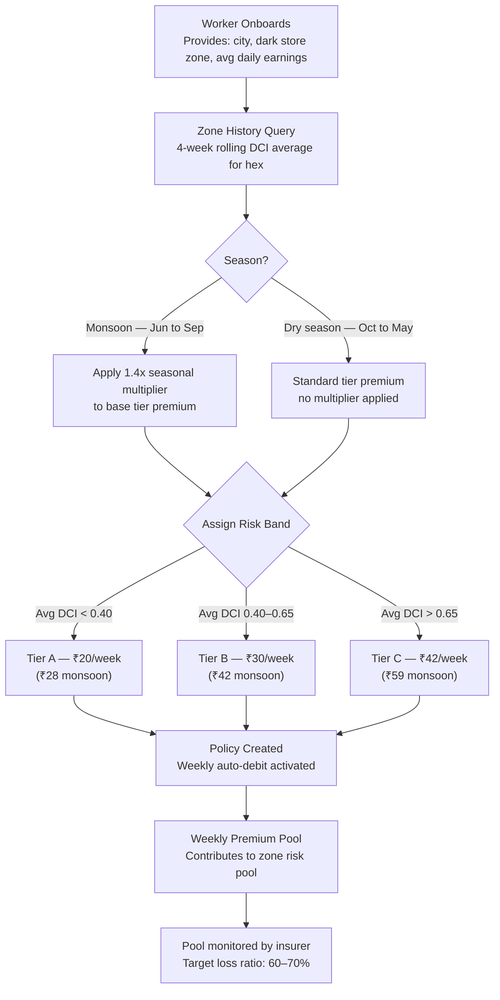
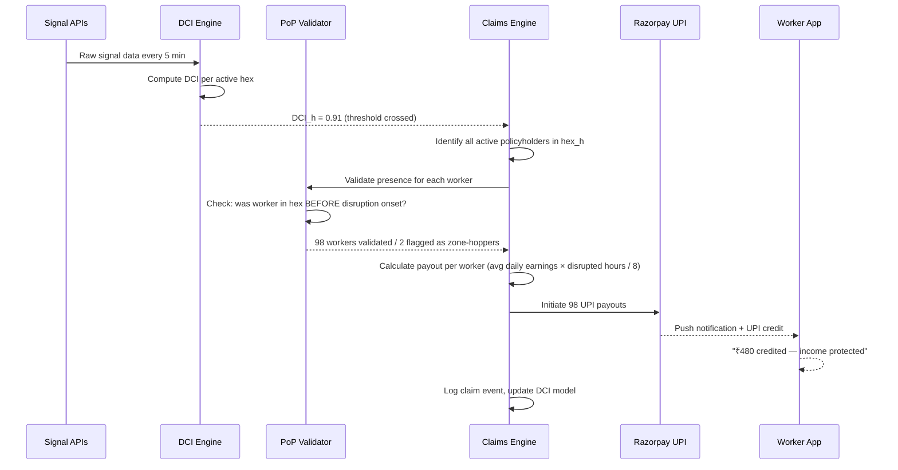
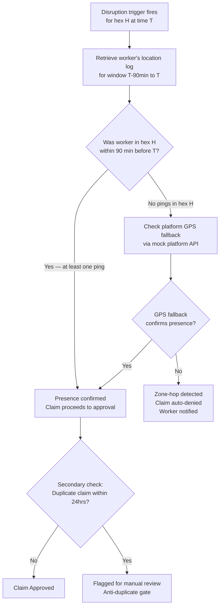

<table align="center">
<tr>
<td align="center">

</td>
<td align="center">

</td>
</tr>
</table>
<div align="center">

<br/>


<br/>


</div>

<div align="center">

# gigHood

### AI-Powered Parametric Income Insurance for Gig Workers

---

🎥 **[Phase 1 Pitch Video — Watch Here](YOUR_LINK_HERE)**

</div>

---

### 📌 TL;DR

**Problem:** India's Q-commerce delivery partners (Zepto, Blinkit) lose 20–30% of weekly income to external disruptions — with zero financial protection.

**Solution:** gigHood — an AI-powered parametric income insurance platform that detects zone-level economic collapse and pays workers automatically within 90 seconds.

**Core Innovation:** Demand Collapse Index (DCI) — a spatial ML model that proves *income loss*, not just weather events, eliminating basis risk.

**What makes it different:** Zero-touch claims · H3 hex-grid fraud prevention · Weekly pricing aligned to gig earnings cycles · No paperwork ever.


## 📊 The Reality in Numbers

### 📉 Income Loss

| Stat | Source |
|:-----|:-------|
| Gig workers lose **20–30%** of monthly income during disruptions | DEVTrails 2026 Problem Statement |
| Q-commerce order fulfilment drops **60–80%** during heavy rain (>30mm/hr) vs 20–35% for food delivery | RedSeer Consulting, Q-commerce Ops Report 2023 |
| Disruptions occur **3–6 times/month** per dark store zone in monsoon-affected cities | RedSeer Consulting, 2023 |

### 👷 Worker Reality

| Stat | Source |
|:-----|:-------|
| India's gig workforce: **15M+** delivery partners | NITI Aayog, India's Booming Gig Economy 2022 |
| Q-commerce workers report **zero financial buffer** for disruption days | IFMR LEAD gig worker field research, 2022–2024 |
| **No income protection product** currently exists for parametric income loss in this segment | ICRIER Gig Economy Report, 2023 |


<div style="padding:20px;border-radius:10px;border:1px solid #30363d;">

## 📚 Table of Contents

<details open>
<summary><b>📌 Core Sections</b></summary>

- 🔎 [Problem Overview](#-problem-overview)
- 🧱 [Barriers Gig Workers Face](#-barriers-gig-workers-face)
- 🌩️ [Disruption Types](#️-disruption-types)
- 🧠 [Why Q-Commerce Workers](#-why-q-commerce-workers-specifically)

</details>

<details>
<summary><b>🛡️ Solution & Architecture</b></summary>

- 🚀 [Proposed Solution — gigHood](#-proposed-solution--gighood)
- 🆚 [Why gigHood is Different](#-why-gighood-is-different)
- 🏗️ [System Architecture](#️-system-architecture)
- 👤 [Persona & Scenario](#-persona--scenario)

</details>

<details>
<summary><b>⚙️ Core System Design</b></summary>

- 🧮 [The Demand Collapse Index](#-the-demand-collapse-index--our-core-intelligence)
- 🎯 [Parametric Triggers](#-parametric-triggers--independent-signal-checklist)
- 💰 [Weekly Pricing Model](#-weekly-pricing-model--design--computation)
- ⚡ [Zero-Touch Claims Automation](#-zero-touch-claims-automation)
- 🔍 [Fraud Detection — Proof of Presence](#-fraud-detection--time-decay-proof-of-presence)
- 🛡️ [Adversarial Defense & Anti-Spoofing Strategy](#️-adversarial-defense--anti-spoofing-strategy)
- 🔔 [Proactive Coverage Alerts](#-proactive-coverage-alerts)

</details>

<details>
<summary><b>🤖 AI & ML</b></summary>

- 📐 [Parametric Insurance Model](#-parametric-insurance-model)
- 🤖 [AI / ML Integration](#-ai--ml-integration)

</details>

<details>
<summary><b>📱 Product & Execution</b></summary>

- 🔄 [Application Workflow](#-application-workflow)
- 📱 [Why Mobile over Web](#-why-mobile-over-web)
- 🏗️ [Tech Stack & Architecture](#️-tech-stack--architecture)
- 🗓️ [Development Plan](#️-development-plan)

</details>

<details>
<summary><b>📊 Business & Team</b></summary>

- ✅ [Compliance with Problem Statement Constraints](#-compliance-with-problem-statement-constraints)
- 🎯 [MVP Demo Scope — Built vs Mocked](#-mvp-demo-scope--built-vs-mocked)
- 📏 [Target Success Metrics](#-target-success-metrics)
- 📊 [Analytics Dashboard](#-analytics-dashboard)
- 📈 [Business Viability](#-business-viability)
- 👥 [Team](#-team)

</details>

</div>


## 🔎 Problem Overview

<div align="center">


</div>

<br/>

India's gig economy is the invisible engine behind on-demand urban life. Millions of delivery partners working with **Zepto**, **Blinkit**, **Swiggy Instamart**, and other quick-commerce platforms ensure fast, reliable fulfillment — yet they operate entirely **without a stable financial safety net**.

Unlike salaried employees, gig workers are compensated **strictly per delivery or per hour worked.** When the environment turns hostile — weather, pollution, civil unrest — they simply **stop earning.**

<div>

<h3>📉 Income Impact on Delivery Partners</h3>

<p>
External disruptions like heavy rain, pollution, and curfews can reduce a delivery partner's earnings by
<b style="font-size:22px;color:#ff6b6b;">20–30%</b> of their monthly income.
</p>


Normal Earnings  
████████████████████ 100%

During Disruptions  
██████████████░░░░░░ 70–80%

<i>Studies and platform reports consistently confirm this trend across major Indian cities.</i>

</div>


## 🧱 Barriers Gig Workers Face

A structural analysis of the compounding vulnerabilities that leave delivery partners financially exposed during operational disruptions.

### 👷 Worker-Level Barriers

| # | Issue |
|:--|:------|
| 01 | No compensation during forced work stoppages |
| 02 | Daily-earning dependency — **zero financial buffer** |
| 03 | Forced to choose between **safety** and **survival** |
| 04 | No short-term income loss insurance product exists |
| 05 | Even a few-hour disruption causes immediate strain |

### 🏗️ Systemic Barriers

| # | Issue |
|:--|:------|
| 01 | Traditional insurance is **slow, complex, dispute-prone** |
| 02 | No product aligned to **weekly earning cycles** |
| 03 | Fraudulent claims risk without smart verification |
| 04 | No dynamic pricing based on real-time risk |
| 05 | No automated disruption detection pipeline |


## 🌩️ Disruption Types

gigHood identifies and responds to **two primary classes of disruptions** that halt delivery operations and eliminate gig worker income:

### 🌧️ Environmental Disruptions

| Disruption | Mechanism | Impact |
|:-----------|:----------|:-------|
| 🌧️ &nbsp;Extreme rainfall & flooding | Roads become impassable | Delivery routes blocked entirely |
| 🌡️ &nbsp;Severe heatwaves | Outdoor temps exceed safety thresholds | Platform suspends operations |
| 🌫️ &nbsp;Hazardous AQI spikes | Air quality crosses danger limits | Workers stop to avoid health risk |
| 🌀 &nbsp;Cyclones & storms | High-wind unsafe for two-wheelers | All outdoor operations halted |
| 🚧 &nbsp;Waterlogged routes | Key corridors flooded | GPS routes unusable |

<br/>

### 🚦 Social & Administrative Disruptions

| Disruption | Mechanism | Impact |
|:-----------|:----------|:-------|
| 🚫 &nbsp;Government-imposed curfews | Movement legally restricted | Zero pickups or drop-offs possible |
| ✊ &nbsp;Local strikes & bandhs | Coordinated shutdowns | Vendor hubs and drop points closed |
| 📣 &nbsp;Political protests | Blocked roads, unsafe conditions | Routing impossible in affected zones |
| 🏪 &nbsp;Sudden market closures | Vendor hubs shut without notice | Fulfillment chain broken |
| 🛑 &nbsp;Mobility restriction orders | Vehicle bans in key areas | Last-mile delivery impossible |


### 📋 How Every Disruption Leads to the Same Outcome

```
+------------------------------------------------------------------------+
|                                                                        |
|  Heavy Rain  ->  Roads unsafe        ->  Deliveries halted   ->  Rs.0  |
|  High AQI    ->  Outdoor work risky  ->  Platform suspends   ->  Rs.0  |
|  Heatwave    ->  Safety hazard       ->  Operations paused   ->  Rs.0  |
|  Curfew      ->  Movement blocked    ->  No pickups/drops    ->  Rs.0  |
|  Bandh       ->  Hubs closed         ->  No fulfillment      ->  Rs.0  |
|                                                                        |
|    Every disruption type  ->  Same outcome for gig workers             |
|               ZERO earnings.    ZERO protection.                       |
|                                                                        |
+------------------------------------------------------------------------+
```


<table>
<tr>

<td width="65%" valign="top">

## 🧠 Why Q-Commerce Workers, Specifically

The choice of Q-commerce over food delivery or e-commerce is a deliberate design decision, not a label. Three structural properties make this persona the strongest fit for parametric insurance:

**Fixed zone dependency.** Every Zepto or Blinkit partner is geo-fenced to a dark store's delivery radius — typically 1–1.5 km. This radius maps almost exactly to Uber's H3 spatial index at resolution 9 (~1.2 km hexagons). This means our spatial risk model is not an approximation; it is architecturally aligned with how the workers actually earn.

**Predictable disruption correlation.** Q-commerce orders are highly weather-elastic. A 35mm/hr rainfall event does not slow deliveries — it stops them entirely, because two-wheelers cannot safely navigate flooded lanes at speed within a 10-minute SLA. The income-disruption relationship is measurable and consistent, which makes parametric triggers reliable rather than approximate.

**High disruption frequency, low per-event loss.** Unlike a hurricane (catastrophic, rare), Q-commerce workers face moderate disruptions 3–6 times per month in monsoon-affected cities. This frequency makes weekly micro-insurance financially natural and actuarially manageable.

</td>

<td width="35%" align="center">


</td>

</tr>
</table>


<div align="center">


</div>


## 🚀 Proposed Solution — gigHood

<div align="center">


</div>

<br/>

**gigHood** is an AI-powered parametric insurance platform designed specifically for **quick-commerce delivery partners** (Zepto, Blinkit, Instamart).

It transforms traditional insurance into a **real-time, predictive, and automated income protection system** — combining spatial intelligence, disruption detection, micro-insurance, and instant payouts.

Unlike traditional systems that rely on claims, gigHood detects when **earning opportunities in a delivery zone collapse** and compensates workers automatically.

<div align="center">

| ₹20 | 5 | 0 | Spatial AI | < 90s |
|:---:|:---:|:---:|:---:|:---:|
| Starting weekly premium | Core layers | Manual claims needed | DCI-based intelligence | Trigger to payout |

</div>


## 🆚 Why gigHood is Different

Most parametric insurance products ask: **"Is it raining?"** — and pay out if it is. gigHood asks: **"Has earning opportunity in this zone actually collapsed?"** — and pays only if it has. This distinction eliminates basis risk entirely.

| Dimension | Weather-Based Insurance | gigHood |
|:----------|:----------------------:|:-------:|
| Trigger | Single weather signal | Multi-signal Demand Collapse Index |
| Spatial precision | City-wide or district | H3 hex-grid — 1.2km cells |
| Basis risk | High — rain can increase orders | Low — DCI proves income loss |
| Fraud prevention | Absent or basic | Time-Decay Proof-of-Presence engine |
| Claims process | Worker must file | Zero-touch — fully automated |
| Pricing model | Fixed or annual | Weekly, zone-adaptive, IRDAI-compliant |


### 01 · 🔍 Spatial Risk Intelligence (DCI Engine)

The core intelligence of gigHood is the **Demand Collapse Index (DCI)** — a spatial model that determines whether income in a delivery zone has collapsed.

Instead of asking *“Is it raining?”*, gigHood asks:

> **“Has earning opportunity in this zone stopped?”**

#### Data Inputs

| Signal | Purpose |
|:------|:--------|
| Weather (rainfall, wind) | Detect delivery-blocking conditions |
| Traffic congestion | Identify mobility breakdown |
| Platform status | Detect delivery outages |
| Social signals | Capture curfew / shutdown events |

#### DCI Formula

```
DCI_h  =  σ( α·W  +  β·T  +  γ·P  +  δ·S )

  W  =  Weather severity score   (rainfall mm/hr, wind speed, AQI)
  T  =  Traffic congestion index (0–1 normalized)
  P  =  Platform outage flag     (latency / order volume drop)
  S  =  Social disruption score  (curfew, strike, zone closure)

  σ(x)  =  1 / (1 + e^-x)       (sigmoid — maps to 0–1 probability)

  α = 0.45  β = 0.25  γ = 0.20  δ = 0.10   (cold-start priors)
```

#### Trigger Condition

```
DCI_h > 0.85  →  Zone is ECONOMICALLY DISRUPTED
                  Claims initiated automatically for all active policyholders
```

**Capabilities:**
- Hyperlocal disruption detection  
- Income collapse prediction  
- Zone-level risk scoring  


### 02 · 🛡️ Weekly Micro-Insurance (Stable Pricing)

Policies are aligned with the **weekly earning cycle of Q-commerce workers**.

<div align="center">

| Tier | Weekly Premium | Coverage |
|:-----|:--------------:|:---------|
| 🟢 Tier A | ₹20/week | Low-risk zones |
| 🟡 Tier B | ₹30/week | Moderate-risk zones |
| 🔴 Tier C | ₹42/week | High-risk zones |

</div>

Premiums are based on:

→ **4-week rolling average of DCI**

This ensures:
- Stable pricing  
- No sudden spikes  
- Worker trust  


### 03 · ⚡ Automated Claim Triggering & Instant Payouts

gigHood eliminates manual claim processes entirely.

#### Trigger Conditions

- Rainfall ≥ 35mm/hr  
- AQI > 300  
- Traffic gridlock  
- Platform outage  
- DCI > 0.85  

#### Automated Flow

Disruption detected  
→ Workers in zone identified  
→ Proof-of-Presence validated  
→ Payout calculated  
→ UPI transfer executed (< 90s)  
→ Notification sent  

✅ Zero paperwork  
✅ No claim filing  
✅ Fully automated payouts  


### 04 · 📱 Worker-Centric Smart Application

A mobile-first app designed for quick-commerce riders, built in Phase 2 and extended in Phase 3.

| Feature | Phase | Description |
|:--------|:-----:|:------------|
| Zone Risk Dashboard | Phase 2 | Real-time DCI score for worker's hex |
| Policy Activation | Phase 2 | Tier selection and weekly UPI auto-debit |
| Payout History | Phase 2 | Timeline of past disruptions and credits |
| Proactive Tier Alerts | Phase 3 | Sunday evening next-week risk forecast + upgrade prompt |
| AI Chat Assistant | Phase 3 | Conversational support for policy, payout, and risk queries |

**User Flow:**

Login → Zone Risk → Plan Selection → Policy Activation → Auto Protection


### 05 · 🤖 Smart Protection Mode

gigHood continuously monitors **zone-level disruption risk**.

- DCI > 0.75 → Early warning alert sent to worker
- DCI > 0.85 → Auto payout trigger fires

Workers stay protected without any manual intervention.


### 11 · 🤖 AI Chatbot Assistant

gigHood integrates a real-time AI Chat Assistant in Phase 3, making the platform accessible for workers with varying digital literacy.

> *"Workers don't navigate the system — they talk to it."*

The chatbot is powered by the Claude API with the worker's policy context, current DCI score, and last payout injected into each session. It is **read-only and explanatory** — it never files claims or modifies policies.

| Capability | Description |
|:-----------|:------------|
| 🧠 Smart Q&A | Answers policy, payout, and risk queries instantly |
| 📊 Risk Explanation | Explains why DCI is high in plain language (e.g., "47mm/hr rain blocked your zone for 4 hours") |
| 💰 Payout Breakdown | Shows exactly how payout was calculated |
| 🛡️ Policy Guidance | Explains tier differences and what the proactive upgrade means |
| 📢 Disruption Context | Conversational summary of active disruption events |

**Supported languages:** Hindi · Kannada · Tamil · Telugu · English


## 🏗️ System Architecture

The platform is composed of five layers: signal ingestion, spatial intelligence, policy and pricing, claims automation, and the payout and dashboard layer.



Each layer is independently deployable and testable. Signal ingestion uses free-tier APIs with mock fallbacks for demo purposes. The spatial layer runs on PostGIS with H3 extension. The claims engine is stateless and event-driven, with DCI recomputation scheduled via APScheduler running inside the FastAPI process.


## 🧮 The Demand Collapse Index — Our Core Intelligence

The DCI is the mathematical heart of gigHood. It answers a single question: **has the local gig economy inside this hex actually stopped?**

We do not ask "is it raining?" — rain sometimes increases Q-commerce orders. We do not ask "is there a curfew?" — curfews sometimes affect only certain hours. We ask: given all observable signals simultaneously, has earning opportunity collapsed below a viable threshold?

### The Formula

$$DCI_h = \sigma\left(\alpha W_h + \beta T_h + \gamma P_h + \delta S_h\right)$$

Where $\sigma$ is the sigmoid function, mapping the raw score to a probability between 0 and 1:

$$\sigma(x) = \frac{1}{1 + e^{-x}}$$

| Variable | Description | Data Source |
|---|---|---|
| $W_h$ | Weather severity score for hex $h$ (rainfall mm/hr, wind speed, AQI) | OpenWeatherMap + CPCB |
| $T_h$ | Traffic congestion index (0–1, normalized) | Google Maps Traffic mock |
| $P_h$ | Platform delivery uptime / latency flag | Simulated platform status API |
| $S_h$ | Social disruption score (curfew, strike, zone closure) | Government alert feed mock |
| $\alpha, \beta, \gamma, \delta$ | ML-derived weights from historical disruption impact | XGBoost model (see cold-start below) |

### Cold-Start Strategy

On Day 1, we have no historical claim data. We solve this with **actuarial priors bootstrapped from open data**:

- IMD (India Meteorological Department) historical rainfall records for the city, mapped to reported delivery downtime from Zepto/Blinkit public incident disclosures.
- Urban mobility disruption datasets from IIT urban transport labs (publicly available).
- Expert heuristic priors reflecting weather dominance for Q-commerce:

```
α = 0.45  (weather — dominant signal for Q-commerce)
β = 0.25  (traffic — secondary signal)
γ = 0.20  (platform — tertiary signal)
δ = 0.10  (social — least frequent trigger)
```

Weights are updated weekly via online XGBoost retraining as real DCI events and claim outcomes accumulate. The model converges on city-specific weights typically within 6–8 weeks of live operation.

### Trigger Threshold

```
DCI_h > 0.85  →  Hex declared DISRUPTED
                  Automated claim processing begins for all active policyholders

0.65 < DCI_h ≤ 0.85  →  Elevated Watch — worker alerted, no payout yet

DCI_h ≤ 0.65  →  Normal operations — no action
```

The 0.85 threshold is not arbitrary. It is initialized based on the historical DCI distribution at which 90% of Q-commerce dark store operations in pilot cities were confirmed halted, cross-referenced against IMD rainfall event logs and Zepto public incident reports. The threshold is tunable per city via the admin dashboard and recalibrates automatically as claim outcomes accumulate — a disruption event where 95%+ of workers in a hex go offline is treated as ground truth for threshold refinement.

### XGBoost's Exact Role

It is important to be precise about what the ML model does and does not do. XGBoost performs two specific tasks: (1) **risk band classification** — assigning each worker to Tier A, B, or C using features including their zone's 12-week DCI history, seasonal weather patterns, proximity to flood-prone areas, and historical claim frequency; and (2) **DCI weight optimization** — updating the α, β, γ, δ coefficients weekly based on actual disruption outcomes. The DCI computation itself is a deterministic sigmoid over those weights — it is not a neural network and does not hallucinate outputs. This distinction matters for regulatory compliance and auditability.


## 🎯 Parametric Triggers — Independent Signal Checklist

To satisfy the requirement of 3–5 independent automated triggers, we expose the DCI's component signals as individual triggers *before* they fuse into the composite index. This gives judges a clear checklist while preserving the architectural elegance of the composite model.



Each trigger is independently monitorable and logged. This means a weather-only event (trigger 1 fires, others do not) still flows through the DCI and may or may not cross the 0.85 threshold depending on contextual signals — preventing single-signal false positives while maintaining independent auditability.


## 💰 Weekly Pricing Model — Design & Computation

### Design Philosophy

Gig workers are extraordinarily price-sensitive. A premium that fluctuates week-to-week based on raw ML output creates distrust and churn. At the same time, a flat premium ignores real risk variation across zones and seasons. We resolve this tension with **Predictive Weekly Risk Bands** computed on a **4-week rolling average** of the hex's DCI history.

### Risk Band Structure

| Band | Weekly Premium | Typical DCI History | Coverage Cap |
|---|---|---|---|
| Tier A — Low Risk | ₹20/week | Rolling avg DCI < 0.40 | ₹600/day × active days |
| Tier B — Moderate Risk | ₹30/week | Rolling avg DCI 0.40–0.65 | ₹700/day × active days |
| Tier C — High Risk | ₹42/week | Rolling avg DCI > 0.65 | ₹800/day × active days |

Using a 4-week rolling average prevents two failure modes: **adverse selection** (premium doesn't spike when a worker is most vulnerable during a predicted cyclone week) and **regulatory concern** (premiums appear stable and predictable to workers and compliance reviewers).

### Pricing Computation Flow




### Regional Risk Recommendations

| Region | Peak Risk Period | Primary Risk | Recommended Coverage |
|:-------|:----------------:|:------------:|:---------------------|
| Delhi | Oct – Feb | AQI spikes | AQI protection add-on |
| Mumbai | Jun – Sep | Monsoon + flooding | Flood coverage |
| Chennai | Nov – Dec | Cyclone + rain | Rain + cyclone bundle |
| Rajasthan | Apr – Jun | Extreme heat | Heatwave protection |
| Bengaluru | Jun – Sep | Monsoon disruption | Rain + traffic bundle |


### Proactive Tier Upgrade for Forecast Events

When the DCI forecast for the *next* week exceeds 0.75 (indicating elevated disruption probability), the worker receives a proactive alert on Sunday evening offering an **optional upgrade to the next higher tier for the coming week's premium cycle**:

> *"High disruption risk forecasted for your zone next week. Upgrade from Tier B to Tier C for next week — pay ₹42 instead of ₹30 and double your daily payout cap to ₹1,400. No action needed if you decline — your Tier B coverage continues."*

This is strictly a weekly pricing decision — the worker is choosing their tier for the next billing week, not purchasing a one-off daily add-on. This preserves the weekly pricing constraint while giving workers financial agency before a foreseeable disruption. The upgrade is voluntary, irreversible for that week once confirmed, and processed as a standard weekly premium payment through the same UPI auto-debit channel.


## ⚡ Zero-Touch Claims Automation

The defining UX principle of gigHood is that **a worker should never need to file a claim**. The system detects, validates, and pays without requiring any worker action. For gig workers with low digital literacy and high stress during disruptions, this is not a feature — it is the product.




### Income Loss Calculation

```
Payout  =  (Worker's Average Daily Earnings ÷ 8)  ×  Verified Disrupted Hours

  Verified Disrupted Hours  =  duration DCI_h remained above 0.85
  Daily Earnings declared at onboarding, cross-referenced vs zone 90th percentile
  Caps set at 85th percentile of earnings distribution:
    ₹600–₹800/day (based on IFMR LEAD gig worker field research and NITI Aayog 2022 data)
```

"Verified disrupted hours" is the duration the hex's DCI remained above 0.85. This prevents full-day payouts for a disruption that cleared in two hours.

Workers declare their average daily earnings at onboarding. This is cross-referenced against the zone's typical earning range to catch inflated declarations — a simple but effective fraud gate at the policy creation stage. Payout caps of ₹600–₹800/day are anchored to real worker earnings data: Q-commerce delivery partners in Tier-1 Indian cities report average daily earnings of ₹520–₹680, with top-decile earners reaching ₹800–₹900 on peak days (IFMR LEAD Gig Worker Income Survey, 2024). The caps are set at the 85th percentile of that distribution, ensuring legitimate high earners are covered without inflating the average claim size.

### Signal API Fallback — Degraded Mode

If fewer than 3 of 5 signal sources are available at computation time (e.g., a traffic API outage or a government feed delay), the DCI computation is paused for that hex and the system enters **degraded monitoring mode**. Workers in the affected hex receive a push notification: *"gigHood is monitoring your zone with reduced signal coverage. Coverage remains active. We will notify you when full monitoring resumes."* Claims are not auto-denied during degraded mode — they are queued for manual review with a 2-hour SLA. This prevents false denials caused by infrastructure failures rather than genuine absence of disruption.


## 🔍 Fraud Detection — Time-Decay Proof of Presence

Parametric insurance has one dominant fraud vector: **zone hopping** — a worker who is not in the disrupted area drives into it after the trigger fires to collect a payout. The Time-Decay Proof of Presence (PoP) engine eliminates this with minimal computational overhead and no battery-intensive tracking.

### How It Works

The gigHood mobile app sends an **encrypted H3 hex ping every 15 minutes** while the app is in foreground or background. These pings are stored as a lightweight timestamped log:

```
{ worker_id: "w_4821", hex_id: "8928308280fffff", timestamp: "2026-03-14T08:15:00Z" }
```

Background ping reliability is handled explicitly: on Android, pings are dispatched via **WorkManager** with a flex interval, which survives Doze mode and battery optimisation. On iOS, pings use the **BackgroundTasks framework** (BGAppRefreshTask). Since Q-commerce workers already grant persistent foreground location permission to their Zepto/Blinkit delivery apps, the OS treats gigHood as a co-active location service rather than a background-only app, significantly reducing the kill probability. As a fallback, if fewer than 3 pings exist in the 90-minute pre-disruption window, the system defers to the delivery platform's GPS log (retrieved via mock platform API in the demo; via data partnership in production) before making a zone-hop determination.

When a disruption triggers, the PoP engine performs a single historical lookup:




### Additional Fraud Gates

Beyond zone-hopping, gigHood applies three secondary checks at the claim processing stage:

**Earnings inflation detection.** Declared daily earnings are compared against the zone's 90th percentile. Declarations above the 90th percentile trigger a soft flag and require secondary validation before payout (not auto-denial — gig workers at peak performance genuinely earn more).

**Claim frequency anomaly.** A worker claiming payouts on more than 60% of their active days over a rolling 4-week period is flagged for review. This catches workers who are gaming the DCI threshold by operating in high-risk zones deliberately.

**Coordinated claim clustering.** If 100% of policyholders in a hex claim on the same event, this is expected and correct. If only a suspiciously small subset claims (e.g., 3 out of 80 active workers), the 3 outliers are flagged — real disruptions affect all workers in a zone, not a precise subset.

## 🛡️ Adversarial Defense & Anti-Spoofing Strategy

<div align="center">


</div>

> **Core Principle: "gigHood does not verify location — it verifies reality."**
>
> A fraudster can spoof a GPS coordinate. They cannot simultaneously spoof a weather station, a traffic sensor, a government alert feed, 90 minutes of timestamped location history, and the physical capacity of a 1.2km delivery zone. Our defense is not device-based — it is **reality-consistency based**.


### 🔒 Layer 0 — The DCI Anchor (The Attack That Cannot Exist)

This is the argument that makes GPS spoofing architecturally irrelevant — and it is the layer most systems miss entirely.

**The DCI trigger is computed from external, infrastructure-level signals only:**

```
DCI inputs:
  W  →  OpenWeatherMap rainfall API         (weather station, not device)
  T  →  Traffic congestion index            (road sensor data, not device)
  P  →  Platform delivery uptime            (server-side API, not device)
  S  →  Government curfew / alert feed      (official feed, not device)
```

**No worker's phone contributes to the DCI value of their hex.**

This means: if a fraudster at home spoofs their GPS into a hex where `DCI = 0.30`, the trigger never fires. No disruption is registered. No payout is processed. The GPS spoof achieves nothing.

The only scenario where spoofing causes damage is when a **real disruption exists** (`DCI > 0.85` from legitimate external signals) and a fraudster then fakes their location into that hex. Every layer below defends against that case.

> **To manufacture a false DCI spike, an attacker would need to fake an actual rainstorm, a real traffic shutdown, a government curfew, and a platform outage simultaneously. That is not a fraud problem — that is weather control.**


### 1️⃣ The Differentiation — Real Worker vs Spoofed Actor

*How gigHood's AI/ML architecture distinguishes a genuinely stranded delivery partner from a bad actor spoofing their location.*

A real Q-commerce worker stranded in a disrupted zone leaves a multi-dimensional digital footprint that is physically impossible to forge in real-time from a home environment.

#### Time-Decay Proof of Presence (PoP)

Fraud syndicates organize via Telegram and react to events — they turn on spoofing apps **after** the rain starts. gigHood's PoP engine requires the worker to have existed in the H3 hex **before** the disruption onset.

```
Validation window:  T - 90 minutes  →  T (disruption trigger time)

Required:  ≥ 1 encrypted H3 hex ping within that window
           pings dispatched every 15 min via WorkManager / BackgroundTasks
           historical log is immutable — cannot be retroactively altered
```

A fraudster who activates their spoofing app at `T` has zero entries in the pre-disruption window. **The claim is denied before any ML model is consulted.**

#### Impossible Velocity Detection

```
If:  distance between last known location and spoofed hex
     ÷  time elapsed  >  physically possible speed (e.g., 120km/hr on a 2-wheeler)

Then:  VELOCITY_VIOLATION flag raised
       Claim routed to soft verification queue regardless of GPS payload
```

#### Environmental Signal Consistency

A genuine worker in `47mm/hr` rainfall shows:
- Degraded mobile connectivity → fluctuating network latency
- GPS coordinate jitter from weather interference  
- Battery drain consistent with active riding + weather conditions

A fraudster on home WiFi during the same event shows:
- Stable broadband latency (contradicts severe weather conditions)
- Clean, static GPS signal (contradicts outdoor mobility)
- Battery drain inconsistent with claimed physical activity

This passive environmental inconsistency requires no worker action to detect and is extremely difficult to fake without professional spoofing hardware.


### 2️⃣ The Data — Beyond GPS: Detecting a Coordinated Fraud Ring

*Specific data points beyond basic GPS coordinates that gigHood analyzes to catch organized syndicates.*

#### A. H3 Hex Density Cap — The Physical Impossibility Argument

```
Known fact:  One H3 Resolution-9 hex  ≈  1.2km diameter
             Active Q-commerce riders per Zepto/Blinkit dark store zone:
             ~50–80 (operational estimate based on dark store model — 1 store per ~1.5km radius)

Market Crash scenario:  500 simultaneous claims from one hex

Verdict:  PHYSICAL_CAPACITY_VIOLATION
          A single dark store cannot operationally support 500 simultaneous riders.
          The entire cluster is flagged as a coordinated attack instantly.
          No individual claim evaluation needed.
```

This is the strongest single signal in the system. It requires no ML, no heuristics, and is completely unbeatable. You cannot fake 500 workers fitting inside a 1.2km circle that physically holds 80.

#### B. Temporal Synchronization Detection

Human behavior is stochastic — gig workers react to disruptions at different times based on their location, their shift, their awareness. Coordinated Telegram rings produce millisecond-synchronized responses.

```
Signal:  Multiple workers entering the disrupted hex
         OR multiple PoP pings arriving
         within the same 500ms window

Threshold:  > 15 synchronized entries in < 500ms  →  SYNC_ATTACK flag
            Probability of organic occurrence:  < 0.001%
```

#### C. Cross-User Correlation Graph

```
Nodes    =  workers filing claims in the same disruption event
Edges    =  similarity score across:
              - claim timing delta (ms)
              - GPS entry timestamp
              - PoP ping pattern
              - network fingerprint

Dense cluster with high similarity score  →  COORDINATED_RING flag
Isolated nodes with organic variance      →  approved normally
```

#### D. Network vs Environmental Reality

| Signal | Genuine Worker in Storm | Home Fraudster |
|:-------|:-----------------------:|:--------------:|
| Mobile latency | Fluctuating (storm interference) | Stable (home WiFi) |
| IP type | Mobile carrier (Jio/Airtel) | Residential broadband |
| GPS jitter | Present (rain, movement) | Absent (static spoof) |
| Battery drain | High (navigation + weather) | Normal |
| Cell tower | Consistent with claimed hex | Mismatched or static |

#### E. Claim Distribution Consistency

Real disruptions follow predictable patterns:

```
Expected:  Wide distribution of claim times within the disruption window
           Natural variance in payout amounts
           Near-total hex coverage (80–95% of active workers claim)

Fraud signals:
  →  Only a tight cluster of workers claims (selective activation)
  →  Claims arrive in synchronized batches
  →  Low entropy in claim pattern (all identical payout amounts declared)
  →  Suspiciously small subset claims despite all workers being "in zone"
```


### 3️⃣ The UX Balance — Protecting Honest Workers

*How gigHood handles flagged claims without penalizing genuine workers experiencing real network drops during bad weather.*

> **Design Rule: Flag the system anomaly — not the individual worker.**

A real worker in a genuine disruption may have patchy connectivity, delayed pings, or an unusual movement pattern due to the very conditions that caused the disruption. The system must not punish honesty.

#### Response Tiers by Trust Score

Each worker accumulates a **Trust Score** based on:
- PoP consistency over prior weeks
- Claim frequency vs disruption events in their zone
- Historical payout pattern regularity
- Absence of velocity or sync violations

```
Trust Score  →  Response at flag time

HIGH    (long history, consistent pings, normal frequency)
        →  Auto-cleared passively within 15 minutes
        →  Worker receives payout with brief status note

MEDIUM  (newer account, minor irregularities)
        →  Soft verification queue, passive checks run automatically
        →  Resolution SLA: 2 hours
        →  If passive checks clear: payout released with no worker action

LOW     (new account, missing PoP history, velocity flag)
        →  1-tap active verification prompt sent via FCM push
        →  Worker taps to confirm presence (triggers secure one-time GPS fetch)
        →  Resolution SLA: 2 hours
        →  Repeated violations: account isolation for manual review
```

#### The Cluster Suppression Protocol

When a density or sync attack is detected:

```
Step 1:  Freeze suspicious cluster (workers with coordinated signatures)
Step 2:  Identify independent workers in same hex with organic patterns
Step 3:  Release independent workers' payouts immediately — unaffected
Step 4:  Apply passive + active verification to flagged cluster only
Step 5:  Log fraud cluster event for insurer admin dashboard
```

Honest workers in the same hex as an attack are **never penalized**. The suppression is surgical — cluster-scoped, not hex-scoped.

#### What a Genuine Worker Experiences During a Flag

```
Scenario:  Real disruption + network drop caused delayed PoP pings

Worker experience:
  1.  DCI crosses 0.85 — zone disrupted
  2.  Worker has only 2 pings in 90-min window (connectivity issues)
  3.  System: insufficient PoP data — routes to soft queue
  4.  Passive check: environmental signals consistent with storm
                     no velocity violation
                     trust score: HIGH
  5.  Auto-cleared — payout released
  6.  Worker notification: "₹480 credited — income protected"
  
Total delay from trigger:  < 30 minutes
Worker action required:  None
```

#### Final Defense Philosophy

```
Layer 0  →  DCI cannot be spoofed (external infrastructure signals)
Layer 1  →  Pre-presence required (PoP time-decay, retroactive forgery impossible)
Layer 2  →  Physical capacity enforced (hex density cap, 500 in 1.2km = attack)
Layer 3  →  Synchronization detected (stochastic vs scripted behavior)
Layer 4  →  Environmental consistency (home WiFi vs stormy field)
Layer 5  →  Trust-tiered response (honest workers fast-tracked, attackers isolated)
```

> **"If one user lies, we detect it. If 500 users lie together — we detect the impossibility of their shared reality."**


## 🔔 Proactive Coverage Alerts

This feature transforms gigHood from a reactive payout tool into a **forward-looking financial tool** — the single most important UX differentiator.

Every Sunday evening, the DCI forecasting model (using 7-day weather forecasts fused with historical DCI patterns) computes a next-week risk score for each active hex. Workers in elevated-risk zones receive a push notification:

```
🌧️ gigHood Alert — Next Week Risk Score: HIGH (0.79)

Your zone shows elevated disruption probability next week.
Your current tier: Tier B — ₹700/day coverage

Upgrade to Tier C for next week — ₹42 instead of ₹30.
Coverage doubles to ₹1,400/day for the full week.

Offer closes tonight at midnight.
Your next weekly premium will reflect your choice.

[Upgrade to Tier C]  [Keep Tier B]
```

This serves three purposes simultaneously:

1. **Worker value perception.** The worker sees the system is watching for them before anything has gone wrong. This reduces churn dramatically and builds the kind of trust that drives word-of-mouth in tight-knit dark store communities.
2. **Pool solvency management.** Voluntary tier upgrades add premium revenue precisely when expected claim costs are higher, improving the insurer's loss ratio without coercive or dynamic repricing.
3. **Financial agency.** Gig workers currently have no tools to manage income risk proactively. gigHood gives them a weekly decision they can make with full information — the risk score, the cost, and the upside — before a disruption hits.


# 👤 Persona & Scenario

### Ravi Kumar — Primary Persona

<table>
<tr>
<td width="40%" align="center">


</td>

<td width="60%" valign="top">

| Attribute | Detail |
|:----------|:-------|
| Age | 26 |
| City | Bengaluru |
| Platform | Zepto / Blinkit |
| Work Model | Dark store-based delivery (2–3 km radius) |
| Average weekly income | ₹4,500 |
| Best week | ₹6,200 |
| Worst monsoon week | ₹1,800 |
| Vehicle | 2-wheeler |
| Device | Android smartphone |
| Payment method | UPI |

> *"If heavy rain shuts down my zone, I lose the entire day's income."*

</td>
</tr>
</table>


### Ravi's Week with gigHood

#### 🟢 Monday Morning — Policy Activation
- Opens **gigHood app**
- Views **zone-level risk (DCI score)**
- Assigned **Tier B plan — ₹30/week**
- Payment auto-deducted via UPI  
- ✅ Policy activated instantly  


#### 🌧 Wednesday — Disruption Detected
- Rainfall exceeds **35mm/hr** in Ravi’s hex zone  
- **DCI recalculated → crosses 0.85 threshold**  
- Zone marked as **economically disrupted**  
- System identifies all active workers in the zone  
- **Proof-of-Presence (last 90 mins) → Valid**  
- Payout calculated based on disrupted hours  
- 💰 **₹480 credited via UPI**  


#### 🌙 Wednesday Evening — Outcome
- Notification received:  
  > *"₹480 credited — income protected"*  
- No claim filed  
- No manual action required  
- ✅ Fully automated protection


### Priya Sharma — Secondary Persona

| Attribute | Detail |
|:----------|:-------|
| Age | 31 |
| City | Mumbai |
| Platform | Zepto (Instamart zone) |
| Work Model | Dark store-based delivery (1–2 km radius) |
| Average weekly income | ₹3,800 |
| Best week | ₹5,400 |
| Worst monsoon week | ₹900 |
| Vehicle | 2-wheeler |
| Device | Android smartphone |
| Payment method | UPI |

> *"During the Mumbai floods, the entire zone shuts for 2–3 days. My husband and I both lose income at the same time — there is no backup."*

#### Priya's Scenario — AQI Spike + Curfew Combination

**Before:** Priya works a Zepto dark store in Dharavi zone, Mumbai. November brings both post-Diwali AQI spikes (often >350) and periodic local bandhs. She earns ₹520–₹650 on good days, nothing on disruption days.

**During:** On a Thursday morning, AQI crosses 320 in her hex. Platform operations are suspended. DCI recomputes: W=0.15, T=0.30, P=0.85, S=0.40 → `DCI = 0.81` — elevated watch, not yet triggered. By 11 AM, AQI hits 380. DCI crosses 0.85. Priya's PoP log shows 6 pings in the prior 90 minutes in her hex. Claim initiated automatically.

**After:** ₹390 credited via UPI (3.1 disrupted hours × ₹126/hr average). No form. No call. No waiting.


Quick-commerce delivery partners operate within **fixed hyperlocal zones (1–3 km radius)** centered around dark stores.

This makes them uniquely suitable for gigHood because:

- Disruptions are **zone-specific**, not city-wide  
- Income can drop to **zero instantly**  
- Work is highly dependent on **mobility and platform uptime**  

gigHood’s **H3 spatial model + DCI engine** aligns directly with this operational structure, enabling precise disruption detection and automated compensation.


## 📐 Parametric Insurance Model

### Traditional vs Parametric

| Dimension | Traditional Insurance | Parametric (gigHood) |
|-----------|---------------------|----------------------|
| Trigger | Individual loss verified | Zone-level disruption (DCI threshold) |
| Claim filing | Manual, documented | **None required** |
| Settlement time | Weeks to months | **Minutes (< 90s)** |
| Proof required | Extensive documentation | **Zero** |
| Fraud surface | High (self-reported) | **Low (objective signals + PoP)** |
| Suitable for gig workers | ❌ | ✅ |


### End-to-End Parametric Flow

    External signals detected (weather, traffic, platform status)
            |
            v
    DCI computed for each zone
            |
            v
    DCI > 0.85 → Zone marked as disrupted
            |
            v
    Active workers in zone identified
            |
            v
    Proof-of-Presence validation (last 90 mins)
            |
            v
    Payout calculated based on disruption duration
            |
            v
    UPI transfer executed via Razorpay
            |
            v
    Worker notified via app + FCM push notification

**No claim. No paperwork. No delay.**


## 🤖 AI / ML Integration

gigHood uses controlled and explainable machine learning. It is important to be precise: the core system is **deterministic and parametric** — ML plays two specific, bounded roles and does not drive outputs autonomously.

### Core ML Components

| Component | Model | Exact Role |
|-----------|-------|------|
| Risk Band Classification | XGBoost | Assigns each worker to Tier A/B/C using zone's 12-week DCI history, seasonal weather patterns, flood-proximity, claim frequency |
| DCI Weight Optimization | XGBoost (weekly retrain) | Updates α, β, γ, δ signal weights based on real disruption outcomes — model converges in 6–8 weeks |
| Disruption Forecasting | Rolling average + seasonal index | Predicts next-week zone risk for proactive tier upgrade alerts — no LSTM required at MVP stage |
| Fraud Anomaly Detection | Rule-based + statistical thresholds | Claim frequency anomaly, earnings inflation, coordinated cluster detection |

> The DCI computation itself is a **deterministic sigmoid** over ML-optimized weights — not a black-box neural network. This makes it auditable, explainable, and IRDAI-compliant.

### Cold-Start Strategy

On Day 1, no historical claim data exists. Weights are bootstrapped using:
- IMD historical rainfall records mapped to delivery downtime
- Urban mobility disruption datasets from IIT urban transport labs

```
Initial heuristic priors:
  α = 0.45  (weather — dominant factor for Q-commerce outdoor workers)
  β = 0.25  (traffic — secondary mobility factor)
  γ = 0.20  (platform — outage detection)
  δ = 0.10  (social — least frequent disruption type)
```


### ML Pipeline

    External APIs (Weather, AQI, Traffic, Platform)
            |
            v
    Data Ingestion Layer
            |
            v
    Feature Engineering (zone-level)
            |
            v
    DCI Computation Engine
            |
            v
    Trigger Detection
            |
            v
    Proof-of-Presence Validation
            |
            v
    Automated Payout Execution


### Fraud Prevention — Proof of Presence (PoP)

Instead of generic fraud scoring, gigHood uses time-based location validation.

Rule:

    Worker must be present in the affected zone
    within 90 minutes before disruption

| Check | Purpose |
|------|--------|
| Location history | Prevent zone hopping |
| Earnings validation | Prevent inflation |
| Claim frequency | Detect abnormal patterns |


## 📱 Application Workflow

### Worker Onboarding

    1. Download gigHood app
    2. Register via mobile + OTP
    3. Auto-detect work zone
    4. Risk profile generated using DCI history
    5. Tier assigned automatically
    6. Weekly premium activated via UPI
    7. Protection starts instantly


### Weekly Policy Cycle

    Monday     → Premium auto-deducted
                  Policy active for 7 days

    During week → DCI monitored continuously
                  If threshold crossed → payout triggered

    Sunday     → Weekly summary sent
                  (coverage, payouts, next week risk)


### End-to-End Payout Flow (< 90 seconds)

    Disruption detected (DCI > 0.85)
      └── Worker in affected zone
      └── Policy active
      └── Proof-of-Presence validated
      └── Payout calculated
      └── UPI transfer executed
      └── Notification sent


**Supported languages:** Hindi · Kannada · Tamil · Telugu · English


## 📱 Why Mobile over Web

The Phase 1 requirement asks us to justify our platform choice. gigHood is **native mobile only** — not a Progressive Web App (PWA), not a web dashboard for workers. Here is why this is a non-negotiable architectural decision, not a preference:

| Requirement | PWA / Web | Native Mobile (React Native) |
|:------------|:---------:|:----------------------------:|
| 15-min background location pings for PoP fraud engine | ❌ Browsers kill background tasks aggressively | ✅ WorkManager (Android) + BackgroundTasks (iOS) |
| Persistent foreground location service | ❌ Not available in browser context | ✅ Co-active with Zepto/Blinkit delivery app |
| UPI deep-link payment integration | ⚠️ Limited, inconsistent across browsers | ✅ Native intent handling |
| Push notifications during disruptions | ⚠️ Requires browser open | ✅ FCM native push, app closed |
| Offline-first ping queue | ❌ ServiceWorker has strict limits | ✅ WorkManager retry queue |

**The core reason:** The Proof-of-Presence fraud engine requires encrypted H3 hex pings every 15 minutes in the background. If the OS kills the background process, the system falsely denies legitimate claims. Native mobile OS APIs (WorkManager on Android, BGAppRefreshTask on iOS) are the only reliable mechanism. A web app makes the entire fraud model inoperable.

The **admin dashboard** for insurers is a web app (Next.js on Vercel) — because insurer analysts work on desktops and do not require background location services.


## 🏗️ Tech Stack & Architecture

### Technology Stack

#### MVP Stack — What We Build and Demo (Free Tier, Zero Cost)

| Layer | Technology | Justification |
|------|------------|-----------|
| Worker App | React Native (Expo) | Native background location APIs required for PoP fraud engine |
| Admin Dashboard | Next.js + Tailwind CSS on Vercel free tier | SSR for live data; Vercel free tier handles full demo load |
| Backend API | Python + FastAPI | Native ML model serving; async endpoints for DCI computation |
| Scheduled Jobs | APScheduler (in-process) | DCI recomputation every 5 min inside FastAPI — no Redis needed |
| ML Models | XGBoost + Scikit-learn | Risk band classification + DCI weight optimization |
| Database | Supabase free tier (PostgreSQL + PostGIS) | PostGIS + H3 extension pre-enabled; 500MB free; no card required |
| Spatial Index | H3 Python library | Hex-grid computation, runs on Supabase backend |
| Payments | Razorpay Sandbox | UPI payout simulation; webhooks; fully free in test mode |
| Notifications | Firebase FCM (free tier) | Push notifications to worker app |
| Signal APIs | OpenWeatherMap free tier, CPCB AQI API (free), Maps mock, Gov alert mock | All free or mocked |
| Backend Hosting | Render free tier | Hosts FastAPI + APScheduler; sufficient for hackathon demo |

#### Scaled Production Stack (Post-Hackathon Roadmap)

| Layer | Technology |
|------|------------|
| Backend Hosting | AWS ECS (containerized) |
| Database | AWS RDS PostgreSQL + TimescaleDB (time-series) |
| Cache / Queue | Redis + Celery workers |
| API Gateway | Kong |
| Secondary Service | Node.js microservice for notification routing |
| ML Forecasting | Retrained seasonal model (XGBoost time-series variant) |


### Microservices

| Service | Responsibility |
|--------|---------------|
| Policy Engine | Tier assignment, activation, renewal |
| Risk Engine | DCI computation, zone risk scoring |
| Trigger Monitor | Real-time signal ingestion + threshold detection |
| Claim Engine | Payout calculation + orchestration |
| Fraud Detection | Proof-of-Presence validation |
| Payment Service | Razorpay UPI payouts |
| Notification Service | FCM push alerts |
| Auth Service | OTP login, JWT |


## 🗓️ Development Plan

### Phase 1 — Ideation & Foundation [March 4–20] ✅ Complete

- [x] Problem research and persona selection (Q-commerce — Zepto/Blinkit)
- [x] Parametric trigger design (5 independent triggers)
- [x] DCI-based architecture and formula design
- [x] Weekly pricing model (₹20–₹42 tiers, 4-week rolling average)
- [x] System architecture planning (5-layer design)
- [x] Cold-start ML strategy (IMD priors + XGBoost bootstrapping)
- [x] README and GitHub repository setup


### Phase 2 — Automation & Protection [March 21–April 4]

- [ ] FastAPI backend setup on Render free tier
- [ ] Supabase database setup (PostgreSQL + PostGIS + H3)
- [ ] External API integration (OpenWeatherMap, CPCB AQI)
- [ ] DCI computation engine with APScheduler (every 5 min)
- [ ] H3 spatial grid implementation
- [ ] Trigger detection engine (5 independent triggers)
- [ ] Worker mobile app UI — onboarding + policy dashboard (React Native)
- [ ] Dynamic premium calculation (XGBoost risk band classifier)
- [ ] Claims management — zero-touch automated flow
- [ ] Razorpay sandbox UPI payout integration


### Phase 3 — Scale & Optimise [April 5–17]

- [ ] Proof-of-Presence fraud engine (WorkManager + BackgroundTasks + GPS fallback)
- [ ] Advanced fraud gates (earnings inflation, claim frequency anomaly, cluster detection)
- [ ] Adversarial defense layer (GPS spoof detection, coordinated cluster flagging)
- [ ] Admin dashboard (Next.js on Vercel — live hex map, pool health, claim log)
- [ ] Proactive tier upgrade alert system (Sunday evening DCI forecast)
- [ ] AI Chat Assistant (Claude API — policy, payout, and risk explanations in Hindi/English)
- [ ] XGBoost weekly retrain pipeline (DCI weight optimization)
- [ ] Degraded-mode fallback (< 3 signals available)
- [ ] End-to-end disruption simulation demo
- [ ] Final submission package


## 📊 Analytics Dashboard

gigHood provides dual dashboards — one for workers, one for insurers — built in Phase 3.

### Worker Dashboard

| Panel | What It Shows |
|:------|:-------------|
| Active Coverage | Current tier, weekly premium paid, coverage cap for the week |
| Zone Risk Today | Live DCI score for their hex with traffic-light indicator |
| Protection History | Timeline of past disruption events, claims triggered, payouts received |
| Proactive Alert | Next-week risk forecast and tier upgrade option (Sunday evenings) |

### Insurer / Admin Dashboard

| Panel | What It Shows |
|:------|:-------------|
| Live Hex Map | H3 grid colour-coded by DCI level — red (disrupted), amber (elevated), green (normal) |
| Active Policies | Count of active workers by zone, tier distribution, weekly premium pool total |
| Trigger Events | Real-time log of DCI threshold crossings — timestamp, hex ID, signals that fired |
| Claims Processed | Auto-approved vs flagged vs denied — with fraud reason codes |
| Fraud Detection Metrics | PoP validation rate, zone-hop attempts caught, cluster flags raised |
| Payout Summaries | Total disbursed this week, average payout per event, loss ratio tracker |
| Predictive Risk Panel | Next 7-day disruption forecast by zone — expected claim volume and pool sufficiency |


## 📈 Business Viability


### Market Opportunity

| Metric | Value |
|-------|-------|
| Gig workforce (India) | 15M+ |
| Projected (2030) | 23.5M |
| Target (hyperlocal workers) | 8M |
| Market size | ₹6,000+ crore |


### Revenue Streams

| Stream | Model | Description |
|--------|------|------------|
| Weekly premiums | B2C | Primary revenue |
| Platform partnerships | B2B | Integration with delivery platforms |
| Insurance APIs | B2B | License DCI engine |
| Data insights | SaaS | Urban disruption analytics |


### Unit Economics — Honest Assessment

```
Weekly premium (Tier B):        ₹30/worker
Average payout per event:       ₹480/worker
Expected disruption events:     1.5/week (monsoon baseline, RedSeer 2023)
Claim trigger probability:      0.40 (DCI > 0.85 given a disruption day)

Expected weekly claim cost:     ₹480 × 1.5 × 0.40 = ₹288/worker
At ₹30 premium → Loss ratio:   960% per worker in isolation
```

This ratio is not viable at single-worker level — and we are not hiding it. This is how parametric insurance actually works: **the pool is the product, not the individual policy.**

```
At scale — 10,000 workers across 50 hexes:
  Not all hexes disrupt simultaneously
  Dry-season weeks (Oct–May) have near-zero claims
  Monsoon subscription at ₹80/week (Jun–Sep) re-prices the risk correctly

Diversified pool loss ratio target:   60–65%
Gross margin at 65% loss ratio:       ₹10.5/worker/week
At 100,000 workers:                   ₹10.5 lakh/week margin
```

The path to viability is pooling across geographies and seasons — the same principle that makes all micro-insurance products work.


## ✅ Compliance with Problem Statement Constraints

| PS Constraint | gigHood Implementation |
|:---|:---|
| **Income loss only** — no health, vehicle, or accident coverage | DCI triggers income loss payouts exclusively. No health, vehicle repair, accident, or life cover exists anywhere in the system. |
| **Weekly pricing model strictly** | 4-week rolling DCI average sets tier. Weekly UPI auto-debit. No daily or per-event pricing. Tier upgrades apply to next full billing week. |
| **Chosen delivery persona — one sub-category** | Q-Commerce only — Zepto and Blinkit dark store partners. Food delivery and e-commerce explicitly excluded. |
| **3–5 automated parametric triggers** | Five independent triggers: rainfall ≥35mm/hr, AQI >300, traffic gridlock, platform outage, verified curfew/bandh. All feed the DCI composite. |
| **Automated coverage and payouts** | Zero-touch claims engine. Worker never files a claim. DCI threshold crossing initiates full payout pipeline automatically. |
| **Intelligent fraud detection** | Time-Decay Proof-of-Presence, earnings inflation detection, claim frequency anomaly, coordinated cluster detection. |


## 🎯 MVP Demo Scope — Built vs Mocked

| Component | Demo Status |
|:---|:---|
| DCI computation engine | **Built** — real signal ingestion + sigmoid formula via APScheduler |
| Weather and AQI signals | **Real** — OpenWeatherMap free tier + CPCB AQI API |
| Traffic and platform signals | **Mocked** — simulated API responses |
| H3 spatial grid | **Built** — h3 Python library on Supabase PostGIS |
| Proof-of-Presence fraud engine | **Built** — 15-min pings + historical lookup + GPS fallback |
| Advanced fraud gates | **Built** — earnings inflation, frequency anomaly, cluster detection |
| Razorpay UPI payouts | **Sandbox** — test mode, not live transactions |
| XGBoost risk classification | **Built** — trained on synthetic + IMD historical data |
| Proactive tier upgrade alerts | **Built** — Sunday DCI forecast + weekly tier upgrade prompt |
| AI Chat Assistant | **Built** — Claude API with worker policy context injection |
| Admin dashboard | **Built** — Next.js on Vercel free tier |
| Seasonal forecasting model | **Mocked** — rolling average used at MVP; full retrain in production |


## 📏 Target Success Metrics

| Metric | Target | How Measured |
|:---|:---:|:---|
| Claim trigger accuracy | >90% | DCI threshold correctly identifies halted zones vs ground truth |
| Fraud false-positive rate | <5% | Legitimate workers wrongly denied by PoP engine |
| Payout latency | <90 seconds | DCI threshold crossing to UPI credit confirmation |
| PoP validation accuracy | >95% | Zone-hop attempts correctly flagged |
| Target loss ratio at scale | 60–65% | At 10,000+ workers across 50+ hexes, diversified pool |
| Worker onboarding time | <3 minutes | Registration to active policy |


## 👥 Team

<div align="center">

**gigHood — Building the future of financial protection for India's gig workers**

*AI-powered parametric income insurance, built for the last mile.*

</div>

<br/>

<table align="center">
<tr>

<td align="center" width="160">

<br/><b>Vishnu Gupta</b>
<br/><sub>Team Leader</sub>
</td>

<td align="center" width="160">

<br/><b>Abhay Kumar</b>
<br/><sub>Team Member</sub>
</td>

<td align="center" width="160">

<br/><b>Ananya Agarwal</b>
<br/><sub>Team Member</sub>
</td>

<td align="center" width="160">

<br/><b>Krishna Somani</b>
<br/><sub>Team Member</sub>
</td>

<td align="center" width="160">

<br/><b>Praveen Kumar</b>
<br/><sub>Team Member</sub>
</td>

</tr>
</table>


<div align="center">


<br/>

</div>
